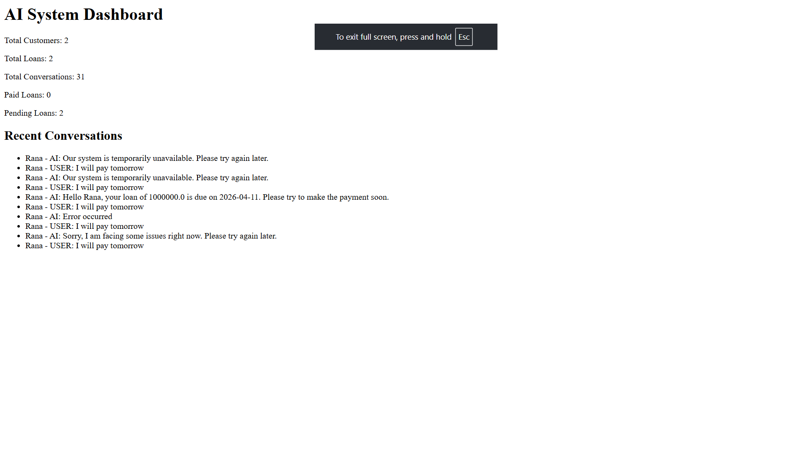

# AI Loan Collection System

This project is something I built to understand how real-world banking systems automate customer interactions, especially around loan collections.

Instead of just creating a basic CRUD app, I wanted to simulate how a system would actually behave in production — handling customer data, interacting through APIs, and responding intelligently like a support or collections agent.

---

## What This Project Does

At a high level, this system:

* Stores customer and loan information
* Exposes APIs that simulate integration with external systems
* Handles conversations between a user and an AI agent
* Logs every interaction for tracking and debugging
* Provides a simple dashboard to monitor system activity

The idea was to bring together backend engineering + system design + AI behavior in one place.

---

## Key Features

* Customer & Loan Management
  Basic CRM structure to manage users and their loan details.

* API Layer
  Built REST APIs to fetch customer data, update loan status, and handle conversations.

* AI Conversation Engine
  A prompt-based system that generates responses using customer context (name, loan amount, due date, etc.).
  Also includes a fallback mechanism in case the AI service is unavailable.

* Conversation Flow
  Designed a simple state-based flow (like reminder → negotiation → closure) to simulate real collection calls.

* Logging System
  Every message (user + AI) is stored in the database. This helps in debugging and analyzing conversations.

* Dashboard
  A basic UI to see total customers, loans, and recent interactions.

---

## Tech Stack

* Django
* Django REST Framework
* OpenAI API (with fallback handling)
* SQLite (for now, can be switched to PostgreSQL)
* Postman / Thunder Client for testing

---

## API Endpoints

Some of the main endpoints:

* GET `/api/customer/<phone>/` → Fetch customer details
* GET `/api/loan/<phone>/` → Fetch loan info
* POST `/api/log/` → Store conversation logs
* POST `/api/loan/update/<phone>/` → Update loan status
* POST `/api/chat/<phone>/` → Talk to the AI system

---

## How the AI Part Works

The system sends a prompt to the AI including:

* Customer name
* Loan amount
* Due date
* Current conversation stage
* User’s message

Based on this, the AI generates a response like a loan collection agent.

If the AI fails (quota / API issue), a fallback response is returned so the system never breaks.

---

## Dashboard

You can access the dashboard here:

/dashboard/

It shows:

* Total customers
* Loan statistics
* Recent conversations

---

## Running the Project

```bash
git clone <your-repo-link>
cd voice_ai_system
python -m venv venv
venv\Scripts\activate
pip install -r requirements.txt
python manage.py migrate
python manage.py runserver
```

---

## Environment Setup

Create a `.env` file and add:

```
OPENAI_API_KEY=your_api_key_here
```

---

## Why I Built This

I wanted to move beyond basic projects and build something closer to how systems work in real companies — especially where backend, APIs, and AI come together.

This project helped me understand:

* how systems integrate via APIs
* how to design conversation flows
* how to handle failures gracefully
* how to think from a product + engineering perspective

---

## Possible Improvements

* Add authentication
* Improve UI (React frontend)
* Add async processing (Celery)
* Deploy on cloud (AWS / Render)
* Integrate real voice APIs

---

# Screenshots

### Dashboard



[View Full Image](voice_ai_system/screenshots/Dashboard.png)


## Author

Basuki Nath
